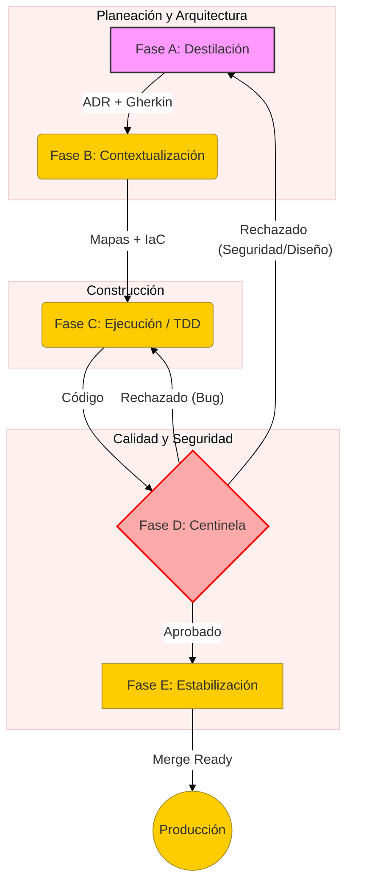

# Manual de Arquitectura ASEF
**Nivel 1: Arquitecto - La Filosofía y Estructura del Framework**

Este documento es la fuente de verdad para entender **cómo piensa y opera** el framework ASEF. Si el README es el "qué", este manual es el "por qué" y el "cómo".

---

## 1. Visión General
ASEF (Agentic Software Engineering Framework) es un sistema diseñado para orquestar la colaboración entre humanos y agentes de Inteligencia Artificial. Su objetivo es transformar ideas ambiguas en software de alta precisión, garantizando seguridad, eficiencia económica y coherencia arquitectónica.

A diferencia de otros métodos, ASEF asume que **la IA es parte del equipo**, no solo una herramienta.

## 2. Los Pilares Técnicos
Para que los agentes trabajen de forma autónoma pero segura, ASEF se apoya en tres columnas:

* **Agentic Workflows:** El trabajo no es lineal; se divide en fases de pensamiento, mapeo, ejecución y auditoría.
* **Architecture-as-Code (AaC):** La arquitectura reside en archivos Markdown y Mermaid, no solo en la memoria de los agentes. Esto permite que el conocimiento sea persistente y auditable.
* **AI-Native Org:** La estructura de carpetas y archivos está diseñada para ser fácilmente legible por una IA, permitiendo que los agentes encuentren contexto relevante con el mínimo consumo de tokens.

---

## 3. El Ciclo de Vida A-B-C-D-E
ASEF sigue un flujo estricto para mitigar alucinaciones y errores.

### Fase A: Destilación (Arquitectura y Comportamiento)
- **Actor:** IA de Alto Razonamiento (ej. Claude 3.5 Sonnet, GPT-4o).
- **Entregable:** Un "Package de Verdad" que contiene el **ADR** (justificación técnica) y los **Escenarios Gherkin** (comportamiento).
- **Regla de Oro:** Ningún código se escribe sin un contrato de Fase A aprobado.

### Fase B: Contextualización (Mapeo e Infra)
- **Actor:** IA de Procesamiento Rápido (ej. Gemini 1.5 Flash).
- **Entregable:** Diagramas Mermaid y plantillas de Infraestructura como Código (IaC).
- **Propósito:** Preparar el entorno y la visión sistémica antes de picar código.

### Fase C: Ejecución (TDD Agéntico)
- **Actor:** Agentes de IDE (Cursor, Windsurf) o modelos locales.
- **Flujo:** Rojo-Verde-Refactor basado estrictamente en los escenarios Gherkin de la Fase A.
- **Optimización:** Uso de modelos económicos y poda de contexto para ahorrar tokens.

### Fase D: Auditoría y Centinela (Seguridad y Calidad)
- **Actor:** Agente Centinela (DevSecOps).
- **Misión:** Validar que el código cumple con el ADR y las políticas de seguridad.
- **Bucle de Retroalimentación:** Si hay fallos de diseño o seguridad, el flujo vuelve a la Fase A o C según corresponda.

### Fase E: Estabilización y Telemetría
- **Acción:** Ejecución de benchmarks locales y proyecciones de costo.
- **Salida:** Reporte de rendimiento y validación de infraestructura.

---

## 4. Gobernanza Humana (Checkpoints)
Aunque los agentes ejecutan, el humano dirige. El humano actúa como el Director de Orquesta en tres puntos críticos:
1.  **Aprobación de ADR:** Antes de iniciar la construcción.
2.  **Aprobación de Seguridad:** Validación de nuevas dependencias sugeridas por la IA.
3.  **Aprobación de Merge:** Firma final tras el reporte de la Fase D.

---

## 5. Eficiencia Económica (Tokenomics)
ASEF está diseñado para ser rentable.
- **Model Tiering:** Usamos modelos potentes (caros) solo para planear, y modelos ligeros (baratos) para ejecutar.
- **Stop-Loss:** Límite de 3 intentos en TDD antes de escalar a revisión humana.
- **Métrica $E_t$:** Relación de líneas de código versus tokens consumidos.

---

## 6. Seguridad Agéntica
El **Agente Centinela** protege el sistema mediante:
- Bloqueo en tiempo real de secretos expuestos.
- Defensa contra ataques de "Prompt Injection".
- Auditoría de cadena de suministro (Supply Chain).

---

## Siguientes Pasos
Una vez entendida la filosofía, procede al nivel operativo:
* [Nivel 2: Operador (Playbook)](playbook.md) - Para empezar a trabajar.
