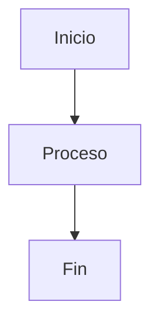

Este es el documento más crítico para la **estandarización**. Sin plantillas, cada agente de IA escribirá con un estilo diferente. La **Biblioteca de Plantillas** garantiza que la información fluya sin fricciones entre el Arquitecto (Fase A), el Constructor (Fase C) y el Centinela (Fase D).

Copia este contenido y guárdalo como `docs/templates.md` o crea archivos individuales dentro de una carpeta `/templates`.

---

# Documento 3: Biblioteca de Plantillas ASEF

**Estándares de comunicación para el ecosistema de agentes**

Este documento contiene las estructuras que deben seguir todos los artefactos generados dentro del framework. Estas plantillas están optimizadas para ser leídas tanto por humanos como por modelos de lenguaje (LLMs).

---

## 1. Template Maestro: ADR + Escenarios Gherkin

**Uso:** Fase A (Destilación). Este archivo debe crearse en `docs/adr/000X-nombre-descriptivo.md`.

```markdown
# ADR-[Número]: [Título de la Decisión]

## 1. Estado y Metadatos
* **Fecha:** YYYY-MM-DD
* **Estado:** [Propuesto | Aceptado | Superado por ADR-XXX]
* **Módulos Afectados:** [ej. /packages/api, /contracts]
* **Impacto Económico:** [Bajo | Medio | Alto]

## 2. Contexto y Problema
*Breve descripción del desafío técnico y por qué se requiere una decisión ahora.*

## 3. Decisión de Arquitectura
*La solución técnica elegida. Incluir diagramas Mermaid si es necesario.*



## 4. Especificaciones de Comportamiento (Gherkin)

*Estos escenarios definen el éxito de la implementación para el Agente Constructor.*

**Escenario: [Nombre del Escenario]**

* **Given** [Estado inicial o precondición]
* **When** [Acción realizada por el sistema o usuario]
* **Then** [Resultado esperado o cambio de estado]

## 5. Instrucciones para la Fase C (Ejecución)

* **Alcance:** [Archivos específicos a tocar]
* **Restricciones:** [Lo que NO debe hacer el agente]
* **Tooling:** [ej. Usar Foundry para tests, Viem para el cliente]

## 6. Criterios de Validación (Fase D)

* [ ] Debe pasar el 100% de los tests Gherkin definidos.
* [ ] No debe incrementar la deuda técnica según el Linter.
* [ ] Validación de seguridad específica: [ej. No reentrada en contratos].

```


---

## 2. Manifiesto de Rol del Agente
**Uso:** Fase C (Ejecución). Este archivo se coloca en la raíz del módulo o como `.agent-role.json` para configurar el comportamiento del agente del IDE.

```json
{
  "agent_name": "ASEF-Constructor-Lite",
  "version": "1.0.0",
  "role": "Especialista en Implementación TDD",
  "capabilities": ["Unit Testing", "Refactoring", "Documentation"],
  "rules": [
    "Nunca escribas código sin un archivo .feature o escenario Gherkin previo.",
    "Prioriza la legibilidad y el tipado estricto.",
    "Si un test falla 3 veces, detente y solicita feedback.",
    "Consulta siempre el archivo docs/adr/ correspondiente antes de editar."
  ],
  "context_pruning": {
    "max_files_per_request": 5,
    "focus_folders": ["src/", "tests/"]
  }
}

```

---

## 3. Configuración del Centinela (Security Policies)

**Uso:** Fase D (Seguridad). Archivo `rules/sentinel-policies.yaml`.

```yaml
version: '2025'
policy_name: ASEF_Sentinel_Core
enforcement_level: STRICT

security_checks:
  secrets_detection:
    enabled: true
    patterns: ["api_key", "private_key", "secret", "mnemonic"]
  
  dependency_audit:
    enabled: true
    block_new_packages: true # Requiere aprobación humana
    vulnerability_threshold: HIGH
  
  prompt_injection_defense:
    enabled: true
    monitor_instructions: true

architectural_compliance:
  verify_adr_link: true
  gherkin_coverage_min: 100%

```

---

## 4. Estructura de "Memoria Global"

**Uso:** Fase A (Referencia). Archivo `rules/global-memory.md`.

```markdown
# Memoria Global del Proyecto: [Nombre del Proyecto]

## Restricciones Técnicas Inamovibles
1. **Stack:** [ej. Rust, Next.js, PostgreSQL].
2. **Criptografía:** [ej. Solo usar librerías auditadas por OpenZeppelin].
3. **Estilo de Código:** [ej. Functional Programming sobre OOP].

## Registro de Decisiones Históricas
- **ADR-001:** Se eligió Monorepo para facilitar el contexto de la IA.
- **ADR-010:** Prohibido el uso de APIs externas de terceros sin proxy de seguridad.

```

---

### ¿Cómo implementar este documento?

1. Crea una carpeta llamada `templates/` en tu repositorio.
2. Guarda el contenido del punto 1 como `templates/adr-gherkin.md`.
3. Guarda el punto 2 como `templates/agent-role.json`.
4. El punto 4 debe estar en `rules/global-memory.md` y ser actualizado manualmente cada vez que una decisión de Fase A sea crítica.
